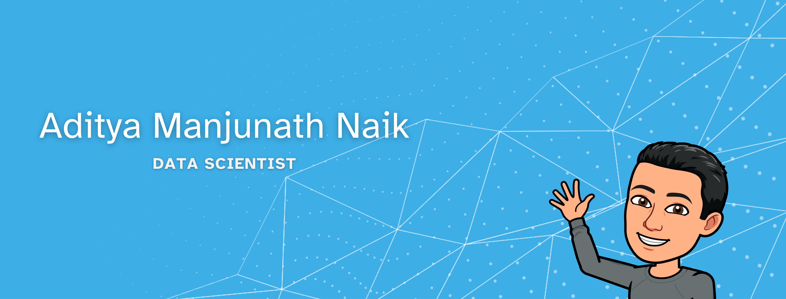

<!--
**AdityaMN98/AdityaMN98** is a ✨ _special_ ✨ repository because its `README.md` (this file) appears on your GitHub profile.

Here are some ideas to get you started:

- 🔭 I’m currently working on ...
- 🌱 I’m currently learning ...
- 👯 I’m looking to collaborate on ...
- 🤔 I’m looking for help with ...
- 💬 Ask me about ...
- 📫 How to reach me: ...
- 😄 Pronouns: ...
- ⚡ Fun fact: ...
-->

<h1 align="center">Hi 👋, I'm Aditya</h1>

<h3 align="left">🚀 About Me:</h3>

I am a recent graduate who holds a Master's in Data Science from the State University of New York at Buffalo, complementing my Bachelor's in Electronics and Communication.

  

I am enthusiastic about using data-driven insights to solve challenging issues and drive meaningful change. I have a solid foundation in statistics, machine learning, and programming languages like Python and R. Throughout my academic journey, I have gained experience working with different kinds of datasets, developing my skills in data preprocessing, modeling, and visualization.

  

I greatly enjoy working in collaborative environments where I can collaborate with multidisciplinary teams to come up with data-driven solutions. I am excited to explore opportunities where I can leverage my skills and contribute to innovative data-driven solutions.

 
Please feel free to reach out to me via email or on LinkedIn.

    

        <h4>LinkedIN</h4>
        
    

    

        <h4>Mail</h4>
        </a>

    

<h3 align="left">Projects:</h3>

Currently, I'm working on a recommendation system that leverages graph embeddings, employing techniques like GraphSAGE and node2vec. The objective is to understand the underlying structures and relationships within the recommendation system graph to deliver personalized recommendations to users. This builds upon prior project which uses bag of words and cosine similarity for providing a recommendation.

In addition, I've worked on  various projects including sentiment analysis utilizing Hugging Face's RoBERTa model, as well as supervised techniques like regression and classification, along with unsupervised learning such as clustering. You can explore all my projects in the [Projects](https://github.com/AdityaMN98/Projects) repository.

<h3 align="left">Skills:</h3>

Python, R, MatLAB, Linear Algebra for Data Science, Statistics, Natural Language Processing, Machine Learning, Predictive Analytics, Data Analysis, Deep Learning, Data Visualization, Artificial Intelligence, Computer Vision, Excel for Data Analysis, Hadoop, Tableau, Apache Spark, Technical Communication, Problem Solving Skills

  
  
  
  
  
  
  
  
  
  
  
  
  
  
  
  
  
  
  
  
  
  
  

<h3 align="left">Interests:</h3>

Machine Learning, Reading, Technology, Artificial Intelligence

